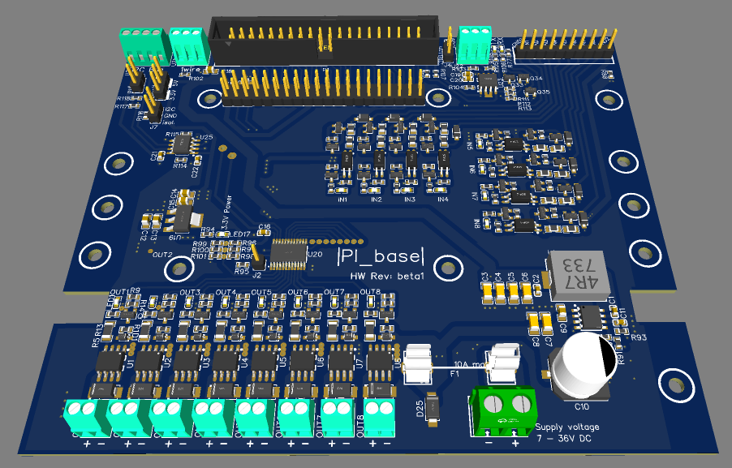

# PI_base
PIbase is designed as a "base board" for a RaspberryPI of any version or size (except nano). You can thing of it as the opposite of a hat. This means a Pi can be mounted ontop and is connected to the base.
This extension provides a bunch of functionality to interconnect with real world applications: power supply, input and output channels, bus connectors etc.

# feature list
- wide input supply voltage 7-36V DC
  - input fuse (5x20mm) onboard
  -  can run from 12V or 24V battery systems (even empty 12V lead acid), solar systems, 24V industrial supply, old notebook PSUs etc
- 5V/3A DCDC converter to  power the PI from input voltage
- 8 channel OUTPUT
  - max 4A per channel, 10A max in total
  - PMOS switching (true "high-side") - no contact weardown as with relais
  - LED indicator for each channel
  - output channels provided by I2C bus IC (TCA9535) - no GPIO of the PI are used
- 8 channel INPUT
  - 5-40V input voltage (even higher input voltage possible)
  - inputs with diode character (optocopler diode input) -> 4-5mA enable current required for improved noise immunity
  - option to provide two groups of true galvanic isolated inputs (2 groups of 4 inputs with isolated common ground)
  - input channels provided by I2C bus IC (TCA9535) - no GPIO of the PI are used
- I2C bus
  - easy access provided by screw terminals
  - I2C bus isolator to protect PI
  - bus voltage selectable by jumper (3.3V/5V)
  - bus pullups selectable by jumper
- 1Wire bus
  - easy access provided by screw terminals
  - onboard bus pullup
  - 3.3V bus supply from LDO (not PI)
- RS485 bus
  - easy access provided by screw terminals
  - onboard half duplex transceiver (SP3485)
  - hardware "transmit enable" circuit to eliminate the need of RX/TX direction control by GPIO pin
  - TX + RX activity LED
- DIN rail mounting support

# hardware description
a detailed documentation of the circuit board can be found here:
[Detailed hardware documentation](HW_description)

# getting started
[You can find examples how to use the board on this page](getting_started)

# Hardware limits
like to bring the hardware to the limit? here you might find documentation of true hardware limits like max currents, heat limits etc sometime in the future ... or provide your own measurements 
